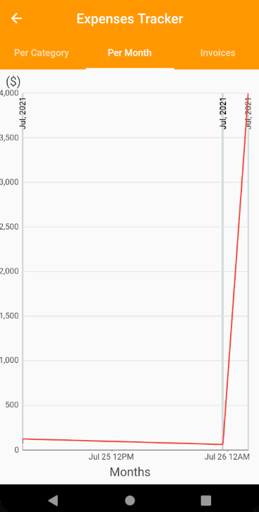
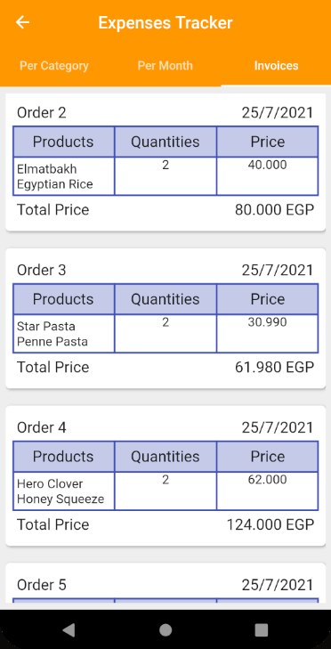

# Auto-Buy

E-commerce application built using flutter SDK and Firebase backend services.

## :star: Main Features:

This project has two interfaces, one for customers (Mobile application) and the other for admins (Web Application) who manage the database.

### :iphone: Mobile Application Main Features:

| Feature | Description| 
| --- | --- |
|**Monthly carts** | Each user has more than one monthly cart delivered to them automatically every month.|
|**The application helper** | Machine learning model that gets user inputs via voice or text messages and returns a customized response depending on user inputs|
|**Expense Tracker** | tracks and visualizes user expenses over months|
|**Wish-list** | Users can  add products to -or delete products from- their wish-list|
|**Friendship System** | Each user has a list of friends and the user can send them gifts from their wishlist using the application|
|**Shopping cart** | Users can  add products to -or delete products from- their shopping cart|

### :computer: Admin Interface Main Features:

| Feature | Description| 
| --- | --- |
|**Authentication** | Admins authenticate themselves using face-recognition and API key|
|**CRUD Operations** | Admins can add/delete products and advertiements to/from the cloud database.|

## :camera: ScreenShots 

### :iphone: Mobile Application ScreenShots:

### :computer: Admin Interface ScreenShots:

## Getting Started

These instructions will get you a copy of the project up and running on your local machine for development and testing purposes.

### Prerequisites

* [Android Studio](https://developer.android.com/studio) - The IDE used.
* [Flutter SDK](https://flutter.dev/)

### Installing

A step by step series of examples that tell you how to get a development env running

* clone this repo to android studio
* run the [chatbot model](https://github.com/Nada-Nasser/Auto_Buy/tree/main/chatbotmodel/chatbottraining) to get API link
* add the API link [here](https://github.com/Nada-Nasser/Auto_Buy/blob/main/auto_buy/lib/blocs/optio_change_notifier.dart#L54)
* run the app in android studio. 

## ⚙️ Built With

* [Flutter SDK](https://flutter.dev/) - to build the mobile application ui
* [Firebase](https://firebase.google.com/)  - used as a backend service
* [Google Cloud](https://cloud.google.com/) 
* [Google Colaboratory](https://colab.research.google.com/)
* [Node js](https://nodejs.org/en/) - web application backend
* [Software Ideas Modeler](https://www.softwareideas.net) - used in the analysis phase to build UML diagrams

## Authors

* **Nada Nasser** - [Nada-Nasser](https://github.com/Nada-Nasser)
* **Farah Afifi** - [farah-afifi](https://github.com/farah-afifi)
* **Hussein Hossam** - [Hussein-Hossam-Idris](https://github.com/Hussein-Hossam-Idris)
* **Omar Ashraf** - [OmarAshrafLabib99](https://github.com/OmarAshrafLabib99)
* **Yousef Adel** - [youssefadel92](https://github.com/youssefadel92)
